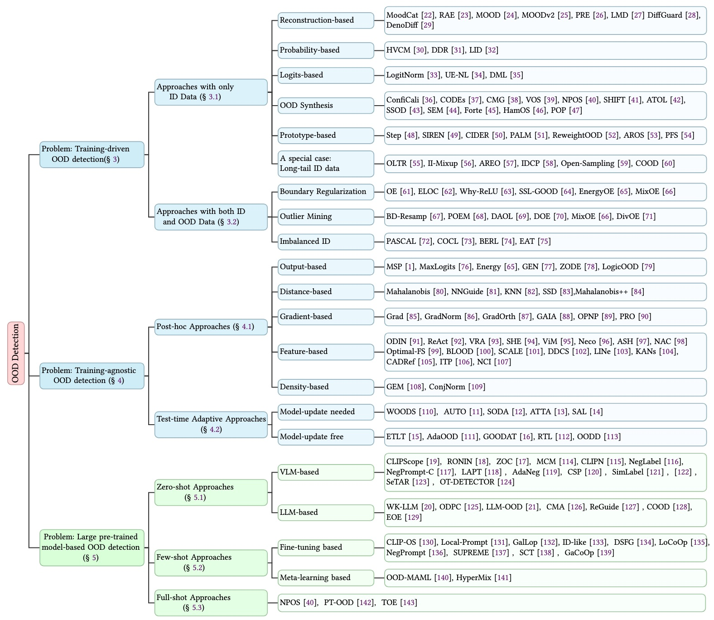

# Awesome Out-of-distribution Detection 

A curated list of awesome out-of-distribution detection resources. 

# Outline

# Contents

- [Training-driven OOD Detection](#Training-driven-OOD-Detection)
  - [Approaches with only ID Data](#approaches-with-only-id-data)
    * [Reconstruction-based](#reconstruction-based)
    * [Density-based](#density-based)
    * [Logits-based](#logits-based)
    * [OOD Synthesis](#ood-synthesis)
    * [Prototype-based](#Prototype-based)
    * [A special case: Long-tail ID data](#Long-tail-ID-data)
  - [Approaches with Both ID and OOD Data](#approaches-with-both-id-and-ood-data)
    * [Boundary Regularization](#Boundary-Regularization)
    * [Outlier Mining](#Outlier-Mining)
    * [Imbalanced ID](#Imbalanced-ID)
- [Training-agnostic OOD Detection](#Training-agnostic-OOD-Detection)
  - [Post-hoc Approaches](#post-hoc-approaches)
    * [Output-based](#Output-based)
    * [Distance-based](#Distance-based)
    * [Gradient-based](#Gradient-based)
    * [Feature-based](#Feature-based)
    * [Density-based](#Density-based)
  - [Test Time Adaptive Approaches](#test-time-adaptive-approaches)
    * [Model update-needed](#model-update-needed)
    * [Model update-free](#model-update-free)
- [LPM-based OOD Detection](#LPM-based-OOD-Detection)
  - [Zero-shot  Approaches](#zero-shot-approaches)
    - [Transitional work](#Transitional-work)
    - [DIffusion-based](#DIffusion-based)
    - [VLM-based](#VLM-based)
    - [LLM-based](#LLM-based)
    - [Zero-shot  ID detection](#Zero-shot-ID-detection)
  - [Few-shot Approaches](#few-shot-approaches)
    - [Study](#Study)
    - [Meta-learning-based](#Meta-learning-based)
    - [Fine-tuning-based](#Fine-tuning-based)

  - [Full-shot Approaches](#full-shot-approaches)
- [Evaluation & Application](#Evaluation&Application)
  - [CV](#CV)
    - [Image Classification](#Image-Classification)
    - [Semantic Segmentation](#Semantic-Segmentation)
    - [Object Detection](#Object-Detection)
    - [Autonomous Driving](#Autonomous-Driving)
    - [Human Action Recognition](#Human-Action-Recognition)
    - [Solar Image Analysis](#Solar-Image-Analysis)
    - [Medical Image Analysis](#Medical-Image-Analysis)
  - [NLP](#NLP)
    - [Survey](#Survey)
    - [Methods](#Methods)
  - [Audio](#Audio)
  - [Graph data](#Graph-data)
    - [Survey](#Survey)
    - [Methods](#Methods)
  - [Reinforcement learning](#Reinforcement-learning)
  - [Others](#Others)

# Training-driven OOD Detection

## Approaches with only ID Data

### Reconstruction-based

- `DiffPath` [Heng et al.]\[NeurIPS 2024]**Out-of-Distribution Detection with a Single Unconditional Diffusion Model**[[PDF](https://openreview.net/forum?id=tTnFH7D1h4&referrer=%5Bthe%20profile%20of%20Harold%20Soh%5D(%2Fprofile%3Fid%3D~Harold_Soh1))]
- `Exploiting Diffusion Prior` [Liu et al.]\[arXiv 2024]**Exploiting Diffusion Prior for Out-of-Distribution Detection**[[PDF](https://arxiv.org/abs/2406.11105)]
- `Resultant` [Li et al.]\[arXiv 2024]**Resultant Incremental Effectiveness on Likelihood for Unsupervised Out-of-Distribution Detection**[[PDF](https://arxiv.org/abs/2409.03801)]
- `DisCoPatch` [Caetano et al.]\[arXiv 2024]**DisCoPatch: Batch Statistics Are All You Need For OOD Detection, But Only If You Can Trust Them**[[PDF](https://arxiv.org/abs/2501.08005)]
- `MOOD` \[Li et al.]\[CVPR 2023]**Rethinking Out-of-distribution (OOD) Detection: Masked Image Modeling is All You Need**[[PDF](https://openaccess.thecvf.com/content/CVPR2023/html/Li_Rethinking_Out-of-Distribution_OOD_Detection_Masked_Image_Modeling_Is_All_You_CVPR_2023_paper.html)]\[[CODE](https://github.com/lijingyao20010602/MOOD)]
- `MOODv2` \[li et al.]\[arXiv]**Moodv2: Masked image modeling for out-of-distribution detection.**[[PDF](https://arxiv.org/abs/2401.02611)]
- `PRE` \[osada et al.]\[WACV 2023]**Out-of-Distribution Detection with Reconstruction Error and Typicality-based Penalty**[[PDF](https://openaccess.thecvf.com/content/WACV2023/html/Osada_Out-of-Distribution_Detection_With_Reconstruction_Error_and_Typicality-Based_Penalty_WACV_2023_paper.html)]
- \[graham et al.]\[CVPR 2023]**Denoising diffusion models for out-of-distribution detection**[[PDF](https://openaccess.thecvf.com/content/CVPR2023W/VAND/html/Graham_Denoising_Diffusion_Models_for_Out-of-Distribution_Detection_CVPRW_2023_paper.html)]\[[CODE](https://github.com/marksgraham/ddpm-ood)]
- `LMD` \[Liu et al.]\[ICML 2023]**Unsupervised Out-of-Distribution Detection with Diffusion Inpainting**[[PDF](https://arxiv.dosf.top/abs/2302.10326)]\[[CODE](https://github.com/zhenzhel/lift_map_detect)]
- `DiffGuard` \[Gao et al.]\[ICCV 2023]**DiffGuard: Semantic Mismatch-Guided Out-of-Distribution Detection using Pre-trained Diffusion Models**[[PDF](https://openaccess.thecvf.com/content/ICCV2023/html/Gao_DIFFGUARD_Semantic_Mismatch-Guided_Out-of-Distribution_Detection_Using_Pre-Trained_Diffusion_Models_ICCV_2023_paper.html)]\[[CODE](https://github.com/cure-lab/DiffGuard)]
- `DenoDiff` \[Graham et al.]\[CVPR 2023]**Denoising diffusion models for out-of-distribution detection**[[PDF](https://arxiv.org/abs/2211.07740)]\[[CODE](https://github.com/marksgraham/ddpm-ood)]
- `MoodCat` \[Yang et al.]\[ECCV 2022]**Out-of-distribution detection with semantic mismatch under masking**[[PDF](https://arxiv.org/abs/2208.00446)]\[[CODE](https://arxiv.org/abs/2208.00446)]
- `RAE` \[Yibo Zhou]\[CVPR 2022]**Rethinking reconstruction autoencoder-based out-of-distribution detection**[[PDF](https://arxiv.org/abs/2203.02194)]

### Probability-based

- `Credal Wrapper` [Wang et al.]\[ICLR 2025 Spotlight]**Credal Wrapper of Model Averaging for Uncertainty Estimation on Out-Of-Distribution Detection**[[PDF](https://openreview.net/forum?id=cv2iMNWCsh)]
- `LID` \[Kamkari et al.]\[ICML 2024] **A Geometric Explanation of the Likelihood OOD Detection Paradox**[[PDF](https://arxiv.org/pdf/2403.18910)]\[[CODE](https://github.com/layer6ai-labs/dgm_ood_detection)]
- `HVCM` \[Li et al.]\[ICCV 2023]**Hierarchical Visual Categories Modeling: A Joint Representation Learning and Density Estimation Framework for Out-of-Distribution Detection**[[PDF](https://openaccess.thecvf.com/content/ICCV2023/html/Li_Hierarchical_Visual_Categories_Modeling_A_Joint_Representation_Learning_and_Density_ICCV_2023_paper.html)]
- `DDR` \[Huang et al.]\[NeurIPS 2022]**Density-driven Regularization for Out-of-distribution Detection**[[PDF](https://proceedings.neurips.cc/paper_files/paper/2022/hash/05b69cc4c8ff6e24c5de1ecd27223d37-Abstract-Conference.html)]

### Logits-based

- `UE-NL` \[Huang et al.]\[CAICE 2023]**Uncertainty-estimation with normalized logits for out-of-distribution detection**[[PDF](https://www.spiedigitallibrary.org/conference-proceedings-of-spie/12645/1264526/Uncertainty-estimation-with-normalized-logits-for-out-of-distribution-detection/10.1117/12.2681144.short#_=_)]
- `DML` \[Zhang et al.]\[CVPR 2023]**Decoupling MaxLogit for Out-of-Distribution Detection**[[PDF](https://openaccess.thecvf.com/content/CVPR2023/html/Zhang_Decoupling_MaxLogit_for_Out-of-Distribution_Detection_CVPR_2023_paper.html)]
- `LogitNorm` \[Wei et al.]\[ICML 2022]**Mitigating neural network overconfidence with logit normalization**[[PDF](https://proceedings.mlr.press/v162/wei22d.html)]\[[CODE](https://github.com/hongxin001/logitnorm_ood)]

### OOD Synthesis

- `FodFoM` [Chen et al.]\[MM 2024]**Fake Outlier Data by Foundation Models Creates Stronger Visual Out-of-Distribution Detector**[[PDF](https://openreview.net/forum?id=iWSVl6mLbW&noteId=iWSVl6mLbW)]
- `ASCOOD` [Regmi et al.]\[arXiv 2024]**Going Beyond Conventional OOD Detection**[[PDF](https://arxiv.org/abs/2411.10794)]
- `OAL` [Gao et al.]\[arXiv 2024]**Enhancing OOD Detection Using Latent Diffusion**[[PDF](https://arxiv.org/abs/2406.16525)]
- `DML-OOD` [Wahd et al.]\[arXiv 2024]**Deep Metric Learning-Based Out-of-Distribution Detection with Synthetic Outlier Exposure**[[PDF](https://arxiv.org/abs/2405.00631)]
- `HamOS` [Li et al.]\[arXiv 2023]**Outlier Synthesis via Hamiltonian Monte Carlo for Out-of-Distribution Detection**[[PDF](https://openreview.net/forum?id=N6ba2xsmds)]
- `SSOD` \[Sen Pei]\[ICLR 2024]**Image background serves as good proxy for out-of-distribution data**[[PDF](https://arxiv.org/abs/2307.00519)]
- `SEM` \[Yang et al.]\[IJCV 2023]**Full-Spectrum out-of-distribution detection**[[PDF](https://arxiv.org/abs/2204.05306)]\[[CODE](https://github.com/Jingkang50/OpenOOD)]
- `NPOS` \[Tao et al.]\[ICLR 2023]**Non-parametric outlier synthesis**[[PDF](https://arxiv.dosf.top/abs/2303.02966)]\[[CODE](https://github.com/deeplearning-wisc/npos)]
- `SHIFT` \[Kwon et al.]\[BMVC 2023]**Improving Out-of-Distribution Detection Performance using Synthetic Outlier Exposure Generated by Visual Foundation Models**[[PDF](https://papers.bmvc2023.org/0010.pdf)]\[[CODE](https://github.com/Anears/SHIFT)]
- `ATOL` \[Zheng et al.]\[NeurIPS 2023]**Out-of-distribution Detection Learning with Unreliable Out-of-distribution Sources**[[PDF](https://proceedings.neurips.cc/paper_files/paper/2023/hash/e43f900f571de6c96a70d5724a0fb565-Abstract-Conference.html)]\[[CODE](https://github.com/tmlr-group/ATOL)]
- `CMG` \[Wang et al.]\[ECML 2022]**CMG: A class-mixed generation approach to out-of-distribution detection**[[PDF](https://www.cs.uic.edu/~liub/publications/ECML-2022-OOD-detection.pdf)]\[[CODE](https://github.com/shaoyijia/CMG)]
- `VOS` \[Du et al.]\[ICLR 2022]**Vos: Learning what you don't know by virtual outlier synthesis**[[PDF](https://arxiv.dosf.top/abs/2202.01197)]\[[CODE](https://github.com/deeplearning-wisc/vos)]
- `CODEs` \[Tang et al.]\[ICCV 2021]**CODEs: Chamfer out-of-distribution examples against overconfidence issue**[[PDF](https://arxiv.org/abs/2108.06024)]
- `ConfiCali` \[Lee et al.]\[ICLR 2018]**Training confidence-calibrated classifiers for detecting out-of-distribution samples**[[PDF](https://arxiv.org/abs/1711.09325)]\[[CODE](https://github.com/alinlab/Confident_classifier)]

### Prototype-based

- `PB&J` [Sit et al.]\[arXiv 2024]**Improving Explainability of Softmax Classifiers Using a Prototype-Based Joint Embedding Method**[[PDF](https://arxiv.org/abs/2407.02271)]
- `PALM` \[Lu et al.]\[ICLR 2024]**Learning with mixture of prototypes for out-of-distribution detection**[[PDF](https://arxiv.org/abs/2402.02653)]\[[CODE](https://github.com/jeff024/PALM)]
- `ReweightOOD` \[Regmi et al.]\[CVPR 2024]**Reweightood: Loss reweighting for distance-based ood detection**[[PDF](https://openaccess.thecvf.com/content/CVPR2024W/TCV2024/papers/Regmi_ReweightOOD_Loss_Reweighting_for_Distance-based_OOD_Detection_CVPRW_2024_paper.pdf)]
- `CIDER` \[Ming et al.]\[ICLR 2023]**How to exploit hyperspherical embeddings for out-of-distribution detection?**[[PDF](https://arxiv.org/abs/2203.04450)]\[[CODE](https://github.com/deeplearning-wisc/cider)]
- `POP` [Gong et al.]\[arXiv 2023]**Out-of-Distribution Detection with Prototypical Outlier Proxy**[[PDF](https://arxiv.org/abs/2412.16884)]
- `Siren` \[Du et al.]\[NeurIPS 2022]**Siren: Shaping representations for detecting out-of-distribution objects**[[PDF](https://papers.nips.cc/paper_files/paper/2022/file/804dbf8d3b8eee1ef875c6857efc64eb-Paper-Conference.pdf)]\[[CODE](https://github.com/deeplearning-wisc/siren)]
- `Step` \[Zhou et al.]\[NeurIPS 2021]**STEP : Out-of-Distribution Detection in the Presence of Limited In-distribution Labeled Data**[[PDF](https://proceedings.neurips.cc/paper_files/paper/2021/file/f4334c131c781e2a6f0a5e34814c8147-Paper.pdf)]

### Long-tail ID data

- `RNA` [Wang et al.]\[arXiv 2023]**Representation Norm Amplification for Out-of-Distribution Detection in Long-Tail Learning**[[PDF](https://arxiv.org/abs/2312.02112)]
- `PATT` [Liu et al.]\[arXiv 2023]**Long-Tailed Out-of-Distribution Detection Prioritizing Attention to Tail**[[PDF](https://arxiv.org/abs/2312.02111)]
- `ImOOD` [Zhang et al.]\[arXiv 2023]**Rethinking Out-of-Distribution Detection on Imbalanced Data Distribution**[[PDF](https://arxiv.org/abs/2312.02110)]
- `COOD` \[Hogeweg et al.]\[CVPR 2024]**Cood: Combined out-of-distribution detection using multiple measures for anomaly & novel class detection in large-scale hierarchical classification**[[PDF](https://openaccess.thecvf.com/content/CVPR2024W/VAND/papers/Hogeweg_COOD_Combined_Out-of-distribution_Detection_Using_Multiple_Measures_for_Anomaly__CVPRW_2024_paper.pdf)]
- `AREO`\[Sapkota et al.]\[ICLR 2023]**Adaptive Robust Evidential Optimization For Open Set Detection from Imbalanced Data**[[PDF](https://par.nsf.gov/servlets/purl/10425432)]
- `IDCP` \[Jiang et al.]\[ICML 2023]**Detecting out-of-distribution data through in-distribution class prior**[[PDF](https://openreview.net/forum?id=charggEv8v)]\[[CODE](https://github.com/tmlr-group/class_prior)]
- `Open-Sampling` \[Wei et al.]\[ICML 2023]**Open-sampling: Exploring out-of-distribution data for re-balancing long-tailed datasets**[[PDF](https://proceedings.mlr.press/v162/wei22c.html)]
- `II-Mixup` \[Mehta et al.]\[MICCAI 2022]**Out-of-distribution detection for long-tailed and fine-grained skin lesion images**[[PDF](https://springer.dosf.top/chapter/10.1007/978-3-031-16431-6_69)]\[[CODE](https://github.com/DevD1092/ood-skin-lesion)]
- `OLTR` \[Liu et al.]\[CVPR 2019]**Large-scale long-tailed recognition in an open world**[[PDF](https://openaccess.thecvf.com/content_CVPR_2019/html/Liu_Large-Scale_Long-Tailed_Recognition_in_an_Open_World_CVPR_2019_paper.html)]\[[CODE](https://liuziwei7.github.io/projects/LongTail.html)]

## Approaches with Both ID and OOD Data

### Boundary Regularization

- `MixOE` \[Zhang et al.]\[WACV 2023]**Mixture Outlier Exposure: Towards Out-of-Distribution Detection in Fine-grained Environments**[[PDF](https://openaccess.thecvf.com/content/WACV2023/html/Zhang_Mixture_Outlier_Exposure_Towards_Out-of-Distribution_Detection_in_Fine-Grained_Environments_WACV_2023_paper.html)]\[[CODE](https://github.com/zjysteven/MixOE)]
- `SSL-GOOD` \[Mohseni et al.]\[AAAI 2020]**Self-supervised learning for generalizable out-of-distribution detection**[[PDF](https://ojs.aaai.org/index.php/AAAI/article/view/5966/5822)]
- `EnergyOE` \[Liu et al.]\[NeurIPS 2020]**Energy-based out-of-distribution detection**[[PDF](https://arxiv.org/abs/2010.03759)]\[[CODE](https://github.com/wetliu/energy_ood)]
- `OE` \[Hendrycks et al.]\[ICLR 2019]**Deep anomaly detection with outlier exposure**[[PDF](https://arxiv.org/abs/1812.04606)]\[[CODE](https://arxiv.org/abs/1812.04606)]
- `Why-RELU` \[Hein et al.]\[CVPR 2019]**Why relu networks yield high-confidence predictions far away from the training data and how to mitigate the problem**[[PDF](https://arxiv.org/abs/1812.05720)]\[[CODE](https://github.com/max-andr/relu_networks_overconfident)]
- `ELOC` \[Vyas et al.]\[ECCV 2018]**Out-of-distribution detection using an ensemble of self supervised leave-out classifier**[[PDF](https://arxiv.org/abs/1809.03576)]

### Outlier Mining

- `DAOL` \[Wang et al.]\[NeurIPS 2023]**Learning to Augment Distributions for Out-of-Distribution Detection**[[PDF](https://proceedings.neurips.cc/paper_files/paper/2023/hash/e812af67a942c21dd0104bd929f99da1-Abstract-Conference.html)]\[[CODE](https://github.com/tmlr-group/DAL)]
- `DOE` \[Wang et al.]\[ICLR 2023]**Out-of-distribution detection with implicit outlier transformation**[[PDF](https://arxiv.dosf.top/abs/2303.05033)]\[[CODE](https://github.com/QizhouWang/DOE)]
- `MixOE` \[Zhang et al.]\[WACV 2023]**Mixture Outlier Exposure: Towards Out-of-Distribution Detection in Fine-grained Environments**[[PDF](https://openaccess.thecvf.com/content/WACV2023/html/Zhang_Mixture_Outlier_Exposure_Towards_Out-of-Distribution_Detection_in_Fine-Grained_Environments_WACV_2023_paper.html)]\[[CODE](https://github.com/zjysteven/MixOE)]
- `DivOE` \[Zhu et al.]\[NeurIPS 2023]**Diversified Outlier Exposure for Out-of-Distribution Detection via Informative Extrapolation**[[PDF](https://proceedings.neurips.cc/paper_files/paper/2023/hash/46d943bc6a15a57c923829efc0db7c7a-Abstract-Conference.html)]\[[CODE](https://github.com/tmlr-group/DivOE)]
- `POEM` \[Ming et al.]\[PMLR 2022]**POEM: Out-of-Distribution Detection with Posterior Sampling**[[PDF](https://proceedings.mlr.press/v162/ming22a.html)]\[[CODE](https://github.com/deeplearning-wisc/poem)]
- `BD-Resamp` \[Li et al.]\[CVPR 2020]**Background data resampling for outlier-aware classification**[[PDF](https://ieeexplore.ieee.org/document/9156976)]\[[CODE](https://github.com/JerryYLi/bg-resample-ood)]

### Imbalanced ID

- `COCL` \[Miao et al.]\[AAAI 2024]**Out-of-Distribution Detection in Long-Tailed Recognition with Calibrated Outlier Class Learning**[[PDF](https://arxiv.dosf.top/abs/2312.10686)]\[[CODE](https://github.com/mala-lab/COCL)]
- `EAT` \[Wei et al.]\[AAAI 2024]**EAT: Towards Long-Tailed Out-of-Distribution Detection**[[PDF](https://arxiv.dosf.top/abs/2312.08939)]\[[CODE](https://github.com/Stomachache/Long-Tailed-OOD-Detection)]
- `BERL` \[Choi et al.]\[CVPR 2023]**Balanced Energy Regularization Loss for Out-of-distribution Detection**[[PDF](https://openaccess.thecvf.com/content/CVPR2023/html/Choi_Balanced_Energy_Regularization_Loss_for_Out-of-Distribution_Detection_CVPR_2023_paper.html)]
- `PASCAL` \[Wang et al.]\[ICML 2022]**Partial and asymmetric contrastive learning for out-of-distribution detection in long-tailed recognition**[[PDF](https://proceedings.mlr.press/v162/wang22aq.html)]\[[CODE](https://github.com/amazon-science/long-tailed-ood-detection)]

# Training-agnostic OOD Detection

## Post-hoc Approaches 

### Output-based

- `AdaSCALE` [Regmi et al.]\[arXiv 2024]**AdaSCALE: Adaptive Scaling for OOD Detection**[[PDF](https://arxiv.org/abs/2503.08023)]
- `MixDiff` [Lee et al.]\[arXiv 2024]**Perturb-and-Compare Approach for Detecting Out-of-Distribution Samples in Constrained Access Environ**[[PDF](https://arxiv.org/abs/2408.10107)]
- `ZODE` \[Xue et al.]\[CVPR 2024]**Enhancing the power of ood detection via sample-aware model selection**[[PDF](https://openaccess.thecvf.com/content/CVPR2024/papers/Xue_Enhancing_the_Power_of_OOD_Detection_via_Sample-Aware_Model_Selection_CVPR_2024_paper.pdf)]
- `LogicOOD` \[Kirchheim et al.]\[WACV 2024]**Out-of-distribution detection with logical reasoning**[[PDF](https://openaccess.thecvf.com/content/WACV2024/papers/Kirchheim_Out-of-Distribution_Detection_With_Logical_Reasoning_WACV_2024_paper.pdf)]\[[CODE](https://github.com/kkirchheim/logic-ood)]
- `GEN` \[Liu et al.]\[CVPR 2023]**GEN: Pushing the limits of softmax-based out-of-distribution detection**[[PDF](https://openaccess.thecvf.com/content/CVPR2023/papers/Liu_GEN_Pushing_the_Limits_of_Softmax-Based_Out-of-Distribution_Detection_CVPR_2023_paper.pdf)]\[[CODE](https://github.com/XixiLiu95/GEN)]
- `MaxLogits` \[Hendrycks et al.]\[ICML 2022]**Scaling out-of-distribution detection for real-world setting**[[PDF](https://arxiv.org/abs/1911.11132)]\[[CODE](https://github.com/hendrycks/anomaly-seg)]
- `Energy` \[Liu et al.]\[NeurIPS 2020]**Energy-based out-of-distribution detection**[[PDF](https://arxiv.org/abs/2010.03759)]\[[CODE](https://github.com/wetliu/energy_ood)]
- `MSP` \[Hendrycks et al.]\[ICLR 2017]**A baseline for detecting misclassified and out-of-distribution examples in neural networks**[[PDF](https://arxiv.org/abs/1610.02136)]\[[CODE](https://github.com/hendrycks/error-detection)]

### Distance-based

- `POT` [Ke et al.]\[ICLR 2025]**Prototype-based Optimal Transport for Out-of-Distribution Detection**[[PDF](https://openreview.net/forum?id=J2we1sVd9m)]
- `LAFO` [Demirel et al.]\[arXiv 2024]**Look Around and Find Out OOD Detection with Relative Angles**[[PDF](https://openreview.net/forum?id=xQit6JBDR5)]
- `NNGuide` \[Park et al.]\[ICCV 2023]**Nearest neighbor guidance for out-of-distribution detection**[[PDF](https://arxiv.org/abs/2309.14888)]\[[CODE](https://github.com/roomo7time/nnguide)]
- `KNN` \[Sun et al.]\[ICML 2022]**Out-of-distribution detection with deep nearest neighbors**[[PDF](https://arxiv.org/abs/2204.06507)]\[[CODE](https://github.com/deeplearning-wisc/knn-ood)]
- `SSD` \[Sehwag et al.]\[ICLR 2021]**Ssd: A unified framework for self-supervised outlier detection**[[PDF](https://arxiv.org/abs/2103.12051)]\[[CODE](https://github.com/inspire-group/SSD)]
- `Mahalanobis` \[Lee et al.]\[NeurIPS 2018]**A simple unified framework for detecting out-of-distribution samples and adversarialattacks**[[PDF](https://arxiv.org/abs/1807.03888)]\[[CODE](https://github.com/pokaxpoka/deep_Mahalanobis_detector)]

### Gradient-based

- `PRO` [Chen et al.]\[arXiv 2024]**Leveraging Perturbation Robustness to Enhance Out-of-Distribution Detection**[[PDF](https://arxiv.org/abs/2503.18784)]
- `GReg` [Sharifi et al.]\[arXiv 2024]**Gradient-Regularized Out-of-Distribution Detection**[[PDF](https://arxiv.org/abs/2404.12368)]
- `OPNP` \[Chen et al.]\[NeurIPS 2024]**Optimal parameter and neuron pruning for out-of-distribution detection**[[PDF](https://arxiv.org/abs/2402.10062)]
- `GradOrth` \[Behpour et al.]\[NeurIPS 2023]**GradOrth: A Simple yet Efficient Out-of-Distribution Detection with Orthogonal Projection of Gradients**[[PDF](https://proceedings.neurips.cc/paper_files/paper/2023/hash/77cf940349218069bbc230fc2c9c8a21-Abstract-Conference.html)]
- `GAIA` \[Chen et al.]\[NeurIPS 2023]**GAIA: Delving into Gradient-based Attribution Abnormality for Out-of-distribution Detection**[[PDF](https://proceedings.neurips.cc/paper_files/paper/2023/hash/fcdccd419c4dc471fa3b73ec97b53789-Abstract-Conference.html)]
- `GradNorm` \[Huang et al.]\[NeurIPS 2021]**On the importance of gradients for detecting distributional shifts in the wild**[[PDF](https://proceedings.neurips.cc/paper_files/paper/2021/hash/063e26c670d07bb7c4d30e6fc69fe056-Abstract.html)]\[[CODE](https://github.com/deeplearning-wisc/gradnorm_ood)]
- `Grad` \[Lee et al.]\[ICIP 2020]**Gradients as a measure of uncertainty in neural networks**[[PDF](https://ieeexplore.ieee.org/abstract/document/9190679/)]

### Feature-based

- `WeiPer` [Granz et al.]\[NeurIPS 2024]**WeiPer: OOD Detection using Weight Perturbations of Class Projections**[[PDF](https://openreview.net/forum?id=8HeUvbImKT&referrer=%5Bthe%20profile%20of%20Manuel%20Heurich%5D(%2Fprofile%3Fid%3D~Manuel_Heurich1)5)]
- `CEA` [Azizmalayeri et al.]\[UAI 2024]**Mitigating Overconfidence in Out-of-Distribution Detection by Capturing Extreme Activations**[[PDF](https://openreview.net/forum?id=nwf2mKQVhP)]
- `NAC` \[Liu et al.]\[ICLR 2024]**Neuron activation coverage: Rethinking out-of-distribution detection and generalization**[[PDF](https://arxiv.org/abs/2306.02879)]\[[CODE](https://github.com/BierOne/ood_coverage)]
- `Neco` \[Ammar et al.]\[ICLR 2024]**NECO: NEural Collapse Based Out-of-distribution detection**[[PDF](https://arxiv.dosf.top/abs/2310.06823)]\[[CODE](https://gitlab.com/drti/neco)]
- `Optimal-FS` \[Zhao et al.]\[ICLR 2024]**Towards optimal feature-shaping methods for out-of-distribution detection**[[PDF](https://arxiv.org/abs/2402.00865)]\[[CODE](https://github.com/Qinyu-Allen-Zhao/OptFSOOD)]
- `BLOOD` \[Jelenić et al.]\[ICLR 2024]**Out-of-distribution detection by leveraging between-layer transformation smoothness**[[PDF](https://arxiv.org/abs/2310.02832)]\[[CODE](https://github.com/fjelenic/between-layer-ood)]
- `SCALE` \[Xu et al.]\[ICLR 2024]**Scaling for training time and post-hoc out-of-distribution detection enhancement**[[PDF](https://arxiv.org/abs/2310.00227)]\[[CODE](https://github.com/kai422/SCALE)]
- `DDCS` \[Yuan et al.]\[CVPR 2024]**Discriminability-driven channel selection for out-of-distribution detection**[[PDF](https://openaccess.thecvf.com/content/CVPR2024/papers/Yuan_Discriminability-Driven_Channel_Selection_for_Out-of-Distribution_Detection_CVPR_2024_paper.pdf)]
- `VRA` \[Xu et al.]\[NeurIPS 2023]**VRA: Variational Rectified Activation for Out-of-distribution Detection**[[PDF](https://proceedings.neurips.cc/paper_files/paper/2023/hash/5c20c00504e0c049ec2370d0cceaf3c4-Abstract-Conference.html)]\[[CODE](https://github.com/zeroQiaoba/VRA)]
- `ASH` \[Djurisic et al.]\[ICLR 2023]**Extremely simple activation shaping for out-of-distribution detection**[[PDF](https://arxiv.dosf.top/abs/2209.09858)]\[[CODE](https://andrijazz.github.io/ash/)]
- `LINe` \[Ahn et al.]\[CVPR 2023]**LINe: Out-of-Distribution Detection by Leveraging Important Neurons**[[PDF](https://arxiv.org/abs/2303.13995)]\[[CODE](https://github.com/YongHyun-Ahn/LINe-Out-of-Distribution-Detection-by-Leveraging-Important-Neurons)]
- `SHE` \[Zhang et al.]\[ICLR 2022]**Out-of-distribution detection based on in-distribution data patterns memorization with modern hopfield energy**[[PDF](https://openreview.net/pdf?id=KkazG4lgKL)]\[[CODE](https://github.com/zjs975584714/SHE)]
- `ViM` \[Wang et al.]\[CVPR 2022]**Vim: Out-of-distribution with virtual-logit matching**[[PDF](https://arxiv.org/abs/2203.10807)]\[[CODE](https://github.com/haoqiwang/vim)]
- `ReAct` \[Sun et al.]\[NeurIPS 2021]**ReAct: Out-of-distribution detection with rectified activations**[[PDF](https://proceedings.neurips.cc/paper/2021/hash/01894d6f048493d2cacde3c579c315a3-Abstract.html)]\[[CODE](https://github.com/deeplearning-wisc/react.git)]
- `ODIN` \[Liang et al.]\[ICLR 2018]**Enhancing the reliability of out-of-distribution image detection in neural networks**[[PDF](https://arxiv.org/abs/1706.02690)]\[[CODE](https://github.com/facebookresearch/odin)]

### Density-based

- `INK` [Burapacheep et al.]\[TMLR 2024]**Your Classifier Can Be Secretly a Likelihood-Based OOD Detector**[[PDF](https://openreview.net/forum?id=FmA1JPWBM8)]
- `ConjNorm` \[Peng et al.]\[ICLR 2024]**ConjNorm: Tractable Density Estimation for Out-of-Distribution Detection**[[PDF](https://arxiv.org/abs/2402.17888)]
- `GEM` \[Morteza et al.]\[AAAI 2022]**Provable Guarantees for Understanding Out-of-distribution Detection**[[PDF](https://arxiv.org/abs/2112.00787)]\[[CODE](https://github.com/PeymanMorteza/GEM)]

## Test Time Adaptive Approaches

### Theoretical support 

- `...`[Fang et al.]\[NeurIPS 2022]**Is Out-of-Distribution Detection Learnable?**[[PDF](https://openreview.net/forum?id=sde_7ZzGXOE)]

- `UniEnt`[Gao et al.]\[arxiv 2024]**Unified Entropy Optimization for Open-Set Test-Time Adaptation**[[PDF](https://arxiv.org/pdf/2404.06065.pdf)]\[[CODE](https://github.com/gaozhengqing/UniEnt)]

### Model update-needed

- `SAL`[Du et al.]\[ICLR 2024]**HOW DOES UNLABELED DATA PROVABLY HELP OUT-OF-DISTRIBUTION DETECTION?** [[PDF](https://openreview.net/forum?id=jlEjB8MVGa)]\[[CODE](https://github.com/deeplearning-wisc/sal)]

- `ATTA`[Gao et al.]\[NeurIPS 2023]**ATTA: Anomaly-aware Test-Time Adaptation for Out-of-Distribution Detection in Segmentation**[[PDF](https://openreview.net/forum?id=bGcdjXrU2w&referrer=%5Bthe%20profile%20of%20Shipeng%20Yan%5D(%2Fprofile%3Fid%3D~Shipeng_Yan1))]\[[CODE](https://github.com/gaozhitong/ATTA)]
- `MOL`[Wu et al.]\[CVPR 2023]**Meta OOD Learning For Continuously Adaptive OOD Detection**[[PDF](https://openaccess.thecvf.com/content/ICCV2023/html/Wu_Meta_OOD_Learning_For_Continuously_Adaptive_OOD_Detection_ICCV_2023_paper.html)]
- `SODA`[Geng et al.]\[arxiv 2023]**SODA: Stream Out-of-Distribution Adaptation**[[PDF](https://openreview.net/forum?id=Ur4LqAOXIF&referrer=%5Bthe%20profile%20of%20Yixuan%20Li%5D(%2Fprofile%3Fid%3D~Yixuan_Li1))]
- `AUTO`[Yang et al.]\[arxiv 2023]**AUTO: Adaptive Outlier Optimization for Online Test-Time OOD Detection**[[PDF](https://arxiv.org/abs/2303.12267)]
- `WOODS`[Katz-Samuels et al.]\[ICML 2022]**Training OOD Detectors in their Natural Habitats**[[PDF](https://arxiv.org/abs/2202.03299)]\[[CODE](https://github.com/jkatzsam/woods_ood)]

### Model update-free

- `RTL`\[Fan et al.]\[CVPR 2024]**Test-time linear out-of-distribution detection**[[PDF](https://openaccess.thecvf.com/content/CVPR2024/papers/Fan_Test-Time_Linear_Out-of-Distribution_Detection_CVPR_2024_paper.pdf)]\[[CODE](https://github.com/kfan21/RTL)]

- `ETLT`[Fan et al.]\[arxiv 2023/CVPR 2024]**A Simple Test-Time Method for Out-of-Distribution Detection**[[PDF](https://arxiv.org/abs/2207.08210)]

- `GOODAT`[Wang et al.]\[AAAI 2024]**Towards Test-time Graph Out-of-Distribution Detection**[[PDF](https://arxiv.org/abs/2401.06176)]

- `AdaOOD`[Zhang et al.]\[arxiv 2023]**Model-free Test Time Adaptation for Out-Of-Distribution Detection**[[PDF](https://arxiv.org/abs/2311.16420)]

# LPM-based OOD Detection

## Zero-shot  Approaches

### **Transitional work**

- `One-Class-Anything`[Ge et al.]\[arxiv 2023]**Building One-class Detector for Anything: Open-vocabulary Zero-shot OOD Detection Using Text-image Models** [[PDF](https://arxiv.org/abs/2305.17207)]\[[CODE](https://github.com/gyhandy/One-Class-Anything)] 

- `...`[Fort et al.]\[NeurIPS 2021]**Exploring the Limits of Out-of-Distribution Detection**[[PDF](https://openreview.net/forum?id=j5NrN8ffXC)]\[[CODE](https://github.com/stanislavfort/exploring_the_limits_of_OOD_detection)]

### **VLM-based**

#### DIffusion-based

- `RONIN`[Nguyen et al.]\[arxiv 2024]**Zero-Shot Object-Level Out-of-Distribution Detection with Context-Aware Inpainting**[[PDF](https://arxiv.org/abs/2402.03292)]

#### CLIP-based
- `OT-DETECTOR` [Liu et al.]\[arXiv 2025]**OT-DETECTOR: Delving into Optimal Transport for Zero-shot Out-of-Distribution Detection**[[PDF](https://arxiv.org/abs/2503.06442)]
- `...` [Zhang et al.]\[ICLR 2025]**SimLabel: Consistency-Guided OOD Detection with Pretrained Vision-Language Models**[[PDF](https://openreview.net/forum?id=Aw1w5sL6ru)]
- `LAPT` [Zhang et al.]\[ECCV 2024]**Label-driven Automated Prompt Tuning for OOD Detection with Vision-Language Models**[[PDF](https://arxiv.org/abs/2407.089666)]
- `OLE` [Ding et al.]\[IJCNN 2024]**Zero-shot out-of-distribution detection with outlier label exposure**[[PDF](https://arxiv.org/pdf/2406.01170)]
- `...` [Jung et al.]\[arxiv 2024]**Enhancing Near OOD Detection in Prompt Learning: Maximum Gains, Minimal Costs**[[PDF](https://arxiv.org/pdf/2405.16091)]
- `SeTAR` [Li et al.]\[NeurIPS 2024]**SeTAR: Out-of-Distribution Detection with Selective Low-Rank Approximation**[[PDF](https://openreview.net/forum?id=65UoJ0z7Kp&referrer=%5Bthe%20profile%20of%20Yun%20Chen%5D(%2Fprofile%3Fid%3D~Yun_Chen1))] [[CODE](https://github.com/X1AOX1A/SeTAR)]
- `CSP` [Liu et al.]\[NeurIPS 2024]**Conjugated Semantic Pool Improves OOD Detection with Pre-trained Vision-Language Models**[[PDF](https://openreview.net/forum?id=qqQFOcUEqM&referrer=%5Bthe%20profile%20of%20Changsheng%20Xu%5D(%2Fprofile%3Fid%3D~Changsheng_Xu1))]
- `CoVer` [Chen et al.]\[NeurIPS 2024]**What If the Input is Expanded in OOD Detection**[[PDF](https://openreview.net/forum?id=XfPiFRnuAS&referrer=%5Bthe%20profile%20of%20Bo%20Du%5D(%2Fprofile%3Fid%3D~Bo_Du3))]
- `AdaNeg`[Zhang et al.]\[NeurIPS 2024]**AdaNeg: Adaptive Negative Proxy Guided OOD Detection with Vision-Language Models**[[PDF](https://arxiv.org/abs/2410.20149)]\[[CODE](https://github.com/YBZh/OpenOOD-VLM)]
- `CLIPScope`[Fu et al.]\[arxiv 2024]**CLIPScope: Enhancing Zero-Shot OOD Detection with Bayesian Scoring**[[PDF](https://arxiv.org/pdf/2405.14737)]
- `NegLabel`[Jiang et al.]\[ICLR 2024]**Negative Label Guided OOD Detection with Pretrained Vision-Language Models**[[PDF](https://openreview.net/forum?id=xUO1HXz4an)]\[[CODE](https://github.com/XueJiang16/NegLabel)]
- `CLIPN`[Wang et al.]\[ICCV 2022]**CLIPN for Zero-Shot OOD Detection: Teaching CLIP to Say No**[[PDF](https://openaccess.thecvf.com/content/ICCV2023/html/Wang_CLIPN_for_Zero-Shot_OOD_Detection_Teaching_CLIP_to_Say_No_ICCV_2023_paper.html)]\[[CODE](https://github.com/xmed-lab/CLIPN)]
- `MCM`[Ming et al.]\[NeurIPS 2022]**Delving into Out-of-Distribution Detection with Vision-Language Representations** [[PDF](https://proceedings.neurips.cc/paper_files/paper/2022/hash/e43a33994a28f746dcfd53eb51ed3c2d-Abstract-Conference.html)]\[[CODE](https://github.com/deeplearning-wisc/MCM)]
- `ZOC` [S'Esmaeilpour et al.]\[AAAI 2022]**Zero-Shot Out-of-Distribution Detection Based on the Pre-trained Model CLIP** [[PDF](https://arxiv.org/abs/2109.02748)]\[[CODE](https://github.com/sesmae/ZOC)]

### **LLM-based**

- `COOD`[Liu et al.]\[arxiv 2024]**COOD: Concept-based Zero-shot OOD Detection**[[PDF](https://arxiv.org/abs/2411.13578)]

- `CMA`[Lee et al.]\[arxiv 2024]**Concept Matching with Agent for Out-of-Distribution Detection**[[PDF](https://arxiv.org/abs/2405.16766)]

- `ReGuide`[Lee et al.]\[arxiv 2024]**Reflexive Guidance: Improving OoDD in Vision-Language Models via Self-Guided Image-Adaptive Concept Generation**[[PDF](https://openreview.net/forum?id=Jk8QwQw8Qw)]

- `...`[Salimben]\[arxiv 2024]**Beyond fine-tuning: LoRA modules boost near-OOD detection and LLM security**[[PDF](https://dlsp2024.ieee-security.org/papers/dls2024-final19.pdf)]

- `VI-OOD`[Zhan et al.]\[arxiv 2024]**VI-OOD: A Unified Representation Learning Framework for Textual**[[PDF](https://arxiv.org/pdf/2404.06217.pdf)]\[[CODE](https://github.com/liam0949/LLM-OOD)]

- `...`[Bendou et al.]\[arxiv 2024]**LLM meets Vision-Language Models for Zero-Shot One-Class Classification**[[PDF](https://arxiv.org/pdf/2404.00675.pdf)]\[[CODE](https://github.com/ybendou/one-class-ZS)]

- `...`[Liu et al.]\[arxiv 2024]**How Good Are Large Language Models at Out-of-Distribution Detection?**[[PDF](https://arxiv.org/abs/2308.10261)]

- `...`[Huang et al.]\[arxiv 2024]**Out-of-Distribution Detection Using Peer-Class Generated by Large Language Model**[[PDF](https://synthical.com/article/baff2745-d4fd-48b7-ba8d-eeca7febf84d)]

- `...`[Dai el al.]\[EMNLP 2023]**Exploring Large Language Models for Multi-Modal Out-of-Distribution Detection**[[PDF](https://aclanthology.org/2023.findings-emnlp.351/)]

### Zero-shot  ID detection

- `GL-MCM`[Miyai et al.]\[arxiv 2023]**Zero-Shot In-Distribution Detection in Multi-Object Settings Using Vision-Language Foundation Models**[[PDF](https://arxiv.org/abs/2304.04521)]\[[CODE](https://github.com/AtsuMiyai/GL-MCM)]

## Few-shot Approaches

### Study

- `...`[Kim et al.]\[ICEIC 2024]**Comparison of Out-of-Distribution Detection Performance of CLIP-based Fine-Tuning Methods**[[PDF](https://ieeexplore.ieee.org/abstract/document/10457104)]
- `...`[Ming et al.]\[IJCV 2023]**How Does Fine-Tuning Impact Out-of-Distribution Detection for Vision-Language Models?**[[PDF](https://link.springer.com/article/10.1007/s11263-023-01895-7)]
- `DSGF`[Dong et al.]\[arxiv 2023]**Towards Few-shot Out-of-Distribution Detection**[[PDF](https://arxiv.org/abs/2311.12076)]
- `...`[Fort et al.]\[NeurIPS 2021]**Exploring the Limits of Out-of-Distribution Detection**[[PDF](https://openreview.net/forum?id=j5NrN8ffXC)]\[[CODE](https://github.com/stanislavfort/exploring_the_limits_of_OOD_detection)]

### Meta-learning-based

- `HyperMix`[Mehta et al.]\[WACV 2024]**HyperMix: Out-of-Distribution Detection and Classification in Few-Shot Settings**[[PDF](https://openaccess.thecvf.com/content/WACV2024/papers/Mehta_HyperMix_Out-of-Distribution_Detection_and_Classification_in_Few-Shot_Settings_WACV_2024_paper.pdf)]

- `OOD-MAML`[Jeong et al.]\[NeurIPS 2020]**OOD-MAML: Meta-Learning for Few-Shot Out-of-Distribution Detection and Classification**[[PDF](https://proceedings.neurips.cc/paper/2020/hash/28e209b61a52482a0ae1cb9f5959c792-Abstract.html)]\[[CODE](https://github.com/twj-KAIST/OOD-MAML)]

### Fine-tuning-based

- `SUPREME` [Wang et al.]\[arXiv 2025]**Mitigating the Modality Gap: Few-Shot Out-of-Distribution Detection with Multi-modal Prototypes and Image-Text Consistency**[[PDF](https://arxiv.org/abs/2502.00662)]
- `GaCoOp` [Tong et al.]\[arXiv 2024]**Enhancing Few-Shot Out-of-Distribution Detection with Gradient Aligned Context Optimization**[[PDF](https://arxiv.org/abs/2411.15736)]
- `CLIP-OS` [Sun et al.]\[arXiv 2024]**CLIP-Driven Outliers Synthesis for Few-Shot Out-of-Distribution Detection**[[PDF](https://arxiv.org/pdf/2404.00323)]
- `NegPrompt` [Li et al.]\[CVPR 2024] **Learning Transferable Negative Prompts for Out-of-Distribution Detection**[[PDF](https://arxiv.org/abs/2404.03248)]\[[CODE](https://github.com/mala-lab/negprompt)]
- `GalLoP` [Lafon et al.]\[arXiv 2024] **GalLoP: Learning Global and Local Prompts for Vision-Language Models**[[PDF](https://arxiv.org/pdf/2407.01400)]
- `Local-Prompt` [Li et al.]\[ICLR 2025]**Local-Prompt: Extensible Local Prompts for Few-Shot Out-of-Distribution Detection**[[PDF](https://openreview.net/forum?id=nanyAujl6e)]
- `SCT` [Yu et al.]\[NeurIPS 2024]**Self-Calibrated Tuning of Vision-Language Models for Out-of-Distribution Detection**[[PDF](https://arxiv.org/abs/2411.03359)]\[[CODE](https://github.com/tmlr-group/SCT)]
- `LSN` [Nie et al.]\[ICLR 2024]**Out-of-Distribution Detection with Negative Prompts**[[PDF](https://openreview.net/forum?id=nanyAujl6e)]
- `ID-like` [Bai et al.]\[CVPR 2024]**ID-like Prompt Learning for Few-Shot Out-of-Distribution Detection**[[PDF](https://arxiv.org/abs/2311.15243)]
- `DSGF` [Dong et al.]\[arXiv 2023]**Towards Few-shot Out-of-Distribution Detection**[[PDF](https://arxiv.org/abs/2311.12076)]
- `LoCoOp`[Miyai et al.]\[NeurIPS 2023]**LoCoOp:Few-Shot Out-of-Distribution Detection via Prompt Learning**[[PDF](https://
openreview.net/forum?id=UjtiLdXGMC)]\[[CODE](https://github.com/AtsuMiyai/LoCoOp)]
### Others

- `Dual-Adapter`[Chen et al.]\[arxiv 2024]**Dual-Adapter: Training-free Dual Adaptation for Few-shot Out-of-Distribution Detection**[[PDF](https://arxiv.org/pdf/2405.16146)]

## Full-shot  Approaches

- `NPOS`[Tao et al.]\[ICLR 2023] **NON-PARAMETRIC OUTLIER SYNTHESIS**[[PDF](https://openreview.net/pdf?id=JHklpEZqduQ)]\[[CODE](https://github.com/deeplearning-wisc/npos)]
- `TOE` [Park et al.]\[NeurIPS 2023]**On the Powerfulness of Textual Outlier Exposure for Visual OoD Detection**[[PDF](https://proceedings.neurips.cc/paper_files/paper/2023/file/a2374637af47ac9471b43c99b68acf27-Paper-Conference.pdf)]\[[CODE](https://github.com/wiarae/TOE)]

- `PT-OOD` [Miyai et al.]\[arxiv 2023]**CAN PRE-TRAINED NETWORKS DETECT FAMILIAR OUT-OF-DISTRIBUTION DATA?**[[PDF](https://arxiv.org/pdf/2310.00847.pdf)]\[[CODE](https://github.com/AtsuMiyai/PT-OOD)]

  

# Evaluation & Application

## CV

###  **Image Classification**

- `OpenOOD v1.5`[Zhang et al.]\[NeurIPS 2023]**OpenOOD v1.5: Enhanced Benchmark for Out-of-Distribution Detection**[[PDF](https://openreview.net/forum?id=vTapqwaTSi)]\[[CODE](https://github.com/Jingkang50/OpenOOD)]

- `MOL`[Wu et al.]\[CVPR 2023]**Meta OOD Learning For Continuously Adaptive OOD Detection**[[PDF](https://openaccess.thecvf.com/content/ICCV2023/html/Wu_Meta_OOD_Learning_For_Continuously_Adaptive_OOD_Detection_ICCV_2023_paper.html)]

- `NINCO`[Bitterwolf et al.]\[ICML 2023]**In or Out? Fixing ImageNet Out-of-Distribution Detection Evaluation**[[PDF](https://proceedings.mlr.press/v202/bitterwolf23a/bitterwolf23a.pdf)]\[[CODE](https://github.com/j-cb/NINCO)]

- `OpenOOD`[Yang et al.]\[NeruIPS 2022]**OpenOOD: Benchmarking Generalized Out-of-Distribution Detection**[[PDF](https://arxiv.org/abs/2210.07242)]\[[CODE](https://github.com/Jingkang50/OpenOOD)]

### Semantic Segmentation

- `...`[ Shojaei et al.]\[ECCV 2024]**Uncertainty Estimation and Out-of-Distribution Detection for LiDAR Scene Semantic Segmentation**[[PDF](http://arxiv.org/abs/2410.08687)]

- `DOoD`[ Galesso et al.]\[ECCV 2024]**Diffusion for Out-of-Distribution Detection on Road Scenes and Beyond**[[PDF](/https://arxiv.org/abs/2407.15739)]\[[CODE](https://github.com/lmb-freiburg/diffusion-for-ood)]

- `...`[ Ancha et al.]\[ICRA 2024]**Deep Evidential Uncertainty Estimation for Semantic Segmentation under OOD Obstacles**[[PDF](https://siddancha.github.io/projects/evidential-segmentation-uncertainty/)]\[[CODE](https://siddancha.github.io/projects/evidential-segmentation-uncertainty/)]

- `ATTA`[Gao et al.]\[NeurIPS 2023]**ATTA: Anomaly-aware Test-Time Adaptation for Out-of-Distribution Detection in Segmentation**[[PDF](https://openreview.net/forum?id=bGcdjXrU2w&referrer=%5Bthe%20profile%20of%20Shipeng%20Yan%5D(%2Fprofile%3Fid%3D~Shipeng_Yan1))]\[[CODE](https://github.com/gaozhitong/ATTA)]

- `...`[Hendrycks et al.]\[ICML 2022]**Scaling Out-of-Distribution Detection for Real-World Settings**[[PDF](https://proceedings.mlr.press/v162/)]

- `SegmentMeIfYouCan`[Chan et al.]\[NeurIPS 2021]**SegmentMeIfYouCan: A Benchmark for Anomaly Segmentation**[[PDF](https://arxiv.org/abs/2104.14812)]

- `Fishyscapes Benchmark`[Blum et al.]\[arxiv 2019]**The Fishyscapes Benchmark: Measuring Blind Spots in Semantic Segmentation**[[PDF](https://arxiv.org/abs/1904.03215)]

### Object Detection

- ` mmood3d`[Kösel et al.]\[IV 2024]**Revisiting Out-of-Distribution Detection in LiDAR-based 3D Object Detection**[[PDF](https://arxiv.org/abs/2404.15879)]\[[CODE](https://github.com/uulm-mrm/mmood3d)]

- ` Proto-OOD`[Chen et al.]\[arxiv 2024]**Proto-OOD: Enhancing OOD Object Detection with Prototype Feature Similarity**[[PDF](https://arxiv.org/abs/2409.05466)]

- `Situation Monitor`[Syed et al.]\[CVPR 2024]**Situation Monitor: Diversity-Driven Zero-Shot Out-of-Distribution Detection using Budding Ensemble Architecture for Object Detection**[[PDF](https://openaccess.thecvf.com/content/CVPR2024W/SAIAD/papers/Qutub_Situation_Monitor_Diversity-Driven_Zero-Shot_Out-of-Distribution_Detection_using_Budding_Ensemble_Architecture_CVPRW_2024_paper.pdf)]

- `RONIN`[Nguyen et al.]\[arxiv 2024]**Zero-Shot Object-Level Out-of-Distribution Detection with Context-Aware Inpainting**[[PDF](https://arxiv.org/abs/2402.03292)]
- `SAFE`[Wilson et al.]\[CVPR 2023]**SAFE: Sensitivity-aware Features for Out-of-distribution Object Detection**[[PDF](https://openaccess.thecvf.com/content/ICCV2023/papers/Wilson_SAFE_Sensitivity-Aware_Features_for_Out-of-Distribution_Object_Detection_ICCV_2023_paper.pdf)]
- `SIREN`[Du et al.]\[NuerIPS 2022]**SIREN: Shaping Representations for Detecting Out-of-Distribution Objects**[[PDF](https://openreview.net/forum?id=8E8tgnYlmN)]\[[CODE](https://github.com/deeplearning-wisc/siren)]

### Autonomous Driving

- `...`[Guo et al.]\[arxiv 2024]**Building Real-time Awareness of Out-of-distribution in Trajectory Prediction for Autonomous Vehicles**[[PDF](https://arxiv.org/abs/2409.17277)]

- `...`[Mao et al.]\[ICRA 2024]**Language-Enhanced Latent Representations for Out-of-Distribution Detection in Autonomous Driving**[[PDF](https://arxiv.org/pdf/2405.01691)]

### **More**

- `Open-Set-FER`[Zhang et al.]\[AAAI 2024]**Open-Set Facial Expression Recognition**[[PDF](https://arxiv.org/abs/2401.12507)]/[[CODE](https://github.com/zyh-uaiaaaa/Open-Set-FER)]

- `FOOD`[Kahya et al.]\[ICIP 2024]**FOOD: Facial Authentication and Out-of-Distribution Detection with Short-Range FMCW Radar**[[PDF](https://arxiv.org/abs/2406.04546)]

- `MultiOOD`[Dong et al.]\[NeurIPS 2024]**MultiOOD: Scaling Out-of-Distribution Detection for Multiple Modalities**[[PDF](https://arxiv.org/abs/2405.17419)]\[[CODE](https://github.com/donghao51/MultiOOD)]

- `...`[Sim et al.]\[ECAI 2023]**A Simple Debiasing Framework for Out-of-Distribution Detection in Human Action Recognition**[[PDF](https://ebooks.iospress.nl/doi/10.3233/FAIA230511)]\[[CODE](https://github.com/Simcs/attention-masking)]

### Solar Image Analysis

- `...`[Giger et al.]\[Space Weather 2023]**Unsupervised Anomaly Detection With Variational Autoencoders Applied to Full-Disk Solar Images** [[PDF](https://agupubs.onlinelibrary.wiley.com/doi/full/10.1029/2023SW003516)]
- `...`[Dan et al.]\[ACM Trans. Cyber-Phys. Syst 2024]**Interpretable Latent Space for Meteorological Out-of-Distribution Detection via Weak Supervision**[[PDF](https://dl.acm.org/doi/pdf/10.1145/3651224)]

### Medical Image Analysis

- `OpenMIBOOD`[Gutbrod et al.]\[arxiv 2025]**OpenMIBOOD： Open Medical Imaging Benchmarks for Out-Of-Distribution Detection**[[PDF](https://arxiv.org/abs/2503.16247)]\[[CODE](https://github.com/remic-othr/OpenMIBOOD)]
- `...`[Liu et al.]\[MICCAI 2024]**Mitral Regurgitation Recognition based on Unsupervised Out-of-Distribution Detection with Residual Diffusion Amplification**[[PDF](https://arxiv.org/abs/2407.21497)]

- `...`[Oh et al.]\[arxiv 2024]**Are We Ready for Out-of-Distribution Detection in Digital Pathology**[[PDF](https://arxiv.org/abs/2407.13708)]

- `EndoOOD`[Tan et al.]\[arxiv 2024]**EndoOOD: Uncertainty-aware Out-of-distribution Detection in Capsule Endoscopy Diagnosis**[[PDF](https://arxiv.org/abs/2402.11476)]
- `...`[Chen et al.]\[ICASSP 2024]**Out-of-Distribution Detection for Learning-Based Chest X-Ray Diagnosis**[[PDF](https://ieeexplore.ieee.org/abstract/document/10447414)]

## NLP

#### Survey

- `...`[Liu et al.]\[arxiv 2025]**A Survey on Transformer Context Extension: Approaches and Evaluation**[[PDF](https://arxiv.org/abs/2503.13299)]
- `...`[Xu et al.]\[arxiv 2024]**Large Language Models for Anomaly and Out-of-Distribution Detection:A Survey**[[PDF](https://arxiv.org/pdf/2409.01980)]
- `...`[Lang et al.]\[TMLR 2023]**A Survey on Out-of-Distribution Detection in NLP**[[PDF](https://arxiv.org/abs/2305.03236)]

#### Methods

- `AHM` \[Constantinou et al.]\[arxiv 2024]**Out-of-Distribution Detection with Attention Head Masking for Multimodal Document Classification**[[PDF](https://arxiv.org/abs/2408.11237)]

- `TV score` \[Wang et al.]\[NeurIPS 2024]**Embedding Trajectory for Out-of-Distribution Detection in Mathematical Reasoning**[[PDF](https://openreview.net/forum?id=hYMxyeyEc5&noteId=lcgt2MxZFl)]

- `LLMOODratio` \[Xhang et al.]\[arxiv 2024]**Your Finetuned Large Language Model is Already a Powerful Out-of-distribution Detector**[[PDF](https://arxiv.org/abs/2404.08679)]\[[CODE](https://github.com/andiac/LLMOODratio)]
- `VI-OOD` \[Zhan et al.]\[COLING 2024]**VI-OOD A Unified Representation Learning Framework for Textual Out-of-distribution Detection**[[PDF](https://aclanthology.org/2024.lrec-main.1510/)]\[[CODE](https://github.com/liam0949/LLM-OOD)]

- `MILTOOD` \[Darrin et al.]\[AAAI 2024]**Unsupervised Layer-Wise Score Aggregation for Textual OOD Detection**[[PDF](https://arxiv.org/abs/2302.09852)]
- `VI-OOD`[Zhan et al.]\[arxiv 2024]**VI-OOD: A Unified Representation Learning Framework for Textual Out-of-distribution Detection**[[PDF](https://arxiv.org/pdf/2404.06217.pdf)]\[[CODE](https://github.com/liam0949/LLM-OOD)]
- `Spatial-aware Adapter`[Gu et al.]\[EMNLP 2023]**A Critical Analysis of Document Out-of-Distribution Detection**[[PDF](https://aclanthology.org/2023.findings-emnlp.332/)]
- `Closer-look`[Zhan et al.]\[Coling 2022]**A Closer Look at Few-Shot Out-of-Distribution Intent Detection**[[PDF](https://aclanthology.org/2022.coling-1.36/)]\[[CODE](https://github.com/liam0949/Few-shot-Intent-OOD)]
- `DCL`[Zhan et al.]\[ACL 2021]**Out-of-scope intent detection with self-supervision and discriminative training** [[PDF](https://aclanthology.org/2021.acl-long.273/)]\[[CODE](https://github.com/liam0949/DCLOOS)]
- `OOD-Text`[Arora et al.]\[EMNLP 2021]**Types of Out-of-Distribution Texts and How to Detect Them**[[PDF](https://aclanthology.org/2021.emnlp-main.835/)]\[[CODE](https://github.com/uditarora/ood-text-emnlp)]

## Acoustic

- `...`[Wen et al.]\[BMVC 2024]**Out-Of-Distribution Detection for Audio-visual Generalized Zero-Shot Learning A General Framework**[[PDF](https://www.arxiv.org/abs/2408.01284)]\[[CODE](https://github.com/liuyuan-wen/AV-OOD-GZSL)]

- `MEJEM`[Hao et al.]\[arxiv 2024]**Exploring Energy-Based Models for Out-of-Distribution Detection in Dialect Identification**[[PDF](https://arxiv.org/abs/2406.18067)]

- `...`[Du et al.]\[arxiv 2024]**Towards Out-of-Distribution Detection in Vocoder Recognition via Latent Feature Reconstruction**[[PDF](https://arxiv.org/abs/2406.02233)]

- `...`[Bukhsh et al.]\[arxiv 2022]**On Out-of-Distribution Detection for Audio with Deep Nearest Neighbors**[[PDF](https://arxiv.org/pdf/2210.15283)]
- `...`[Naranjo-Alcazar et al.]\[Sensors 2020]**Open Set Audio Classification Using Autoencoders Trained on Few Data**[[PDF](https://www.mdpi.com/1424-8220/20/13/3741)]
- `...`[Battaglino]\[IWAENC 2016]**The Open-Set Problem in Acoustic Scene Classification**[[PDF](https://ieeexplore.ieee.org/abstract/document/7602939)]

## Graph data

#### Sruvey & Benchmark

- `...`[Cai et al.]\[arxiv 2025]**Out-of-Distribution Detection on Graphs A Survey**[[PDF](https://www.arxiv.org/abs/2502.08105)]

- `UB-GOLD`[Wang et al.]\[ICLR 2025]**Unifying Unsupervised Graph-Level Anomaly Detection and Out-of-Distribution Detection A Benchmark**[[PDF](https://openreview.net/forum?id=g90RNzs8wX)]

- `...`[Ju et al.]\[arxiv 2024]**A Survey of Graph Neural Networks in Real world: Imbalance, Noise, Privacy and OOD Challenges**[[PDF](https://arxiv.org/abs/2403.04468)]

#### Methods

- `LLM-GOOD`[Xu et al.]\[arxiv 2025]**Few-Shot Graph Out-of-Distribution Detection with LLMs**[[PDF](https://arxiv.org/abs/2503.22097)]

- `GOLD`[Wang et al.]\[ICLR 2025]**GOLD Graph Out-of-Distribution Detection via Implicit Adversarial Latent Generation**[[PDF](https://openreview.net/forum?id=y5einmJ0Yx)]
- `SEGO`[Hou et al.]\[AAAI 2024]**Structural Entropy Guided Unsupervised Graph Out-Of-Distribution Detection**[[PDF](https://arxiv.org/abs/2503.03241)]

- `HGOE`[He et al.]\[ACMMM 2024]**HGOE Hybrid External and Internal Graph Outlier Exposure for Graph Out-of-Distribution Detection**[[PDF](https://arxiv.org/abs/2407.21742)]

- `GR-MOOD`[Shen et al.]\[arxiv 2024]**Optimizing OOD Detection in Molecular Graphs A Novel Approach with Diffusion Models**[[PDF](https://arxiv.org/abs/2404.15625)]

- `GOODAT`[Wang et al.]\[AAAI 2024]**Towards Test-time Graph Out-of-Distribution Detection**[[PDF](https://arxiv.org/abs/2401.06176)]
- `GOOD-D`[Liu et al.]\[WSDM 2023]**GOOD-D: On Unsupervised Graph Out-Of-Distribution Detection**[[PDF](https://dl.acm.org/doi/abs/10.1145/3539597.3570446)]\[[CODE](https://github.com/yixinliu233/G-OOD-D)]

## Reinforcement learning

- `DEXTER`[Nasvytis et al.] [arxiv 2024]**Rethinking Out-of-Distribution Detection for Reinforcement**[[PDF](https://arxiv.org/pdf/2404.07099.pdf)]
  **Learning: Advancing Methods for Evaluation and Detection**
- `AlberDICE`[Matsunaga et al.]\[NuerIPS 2023]**AlberDICE: Addressing Out-Of-Distribution Joint Actions in Offline Multi-Agent RL via Alternating Stationary Distribution Correction Estimation**[[PDF](https://proceedings.neurips.cc/paper_files/paper/2023/hash/e5b6eb1dbabff82838d5e99f62de37c8-Abstract-Conference.html)]

## Others

- `SecDOOD`[Li et al.]\[arxiv 2025]**Secure On-Device Video OOD Detection Without Backpropagation**[[PDF](https://arxiv.org/abs/2503.06166)]

- `TS-OOD`[Gungor et al.]\[arxiv 2025]**TS-OOD: Evaluating Time-Series Out-of-Distribution Detection and Prospective Directions for Progress**[[PDF](https://arxiv.org/abs/2502.15901)]
- `...`[Impiö et al.]\[EUSIPCO 2024]**Improving Taxonomic Image-based Out-of-distribution Detection With DNA Barcodes**[[PDF](https://arxiv.org/abs/2406.18999)]
- `...`[Terres-Escudero et al.]\[arxiv 2024]**Forward-Forward Learning achieves Highly Selective Latent Representations for Out-of-Distribution Detection in Fully Spiking Neural Networks**[[PDF](https://arxiv.org/html/2407.14097v2)]
- `...`[Zhou et al.]\[NeurIPSw 2024]**Evaluating Sparse Galaxy Simulations via Out-of-Distribution Detection and Amortized Bayesian Model **[[PDF](https://arxiv.org/abs/2410.10606)]

## Survey

- `VLM Survey` [Zhang et al.]\[IJCV 2024]**Generalized Out-of-Distribution Detection and Beyond in Vision Language Model Era: A Survey**[[PDF](https://arxiv.org/abs/2405.67890)]
- `LLM Survey` [Xu et al.]\[ACL 2024]**Large Language Models for Anomaly and Out-of-Distribution Detection: A Survey**[[PDF](https://arxiv.org/abs/2409.01980)]

 
